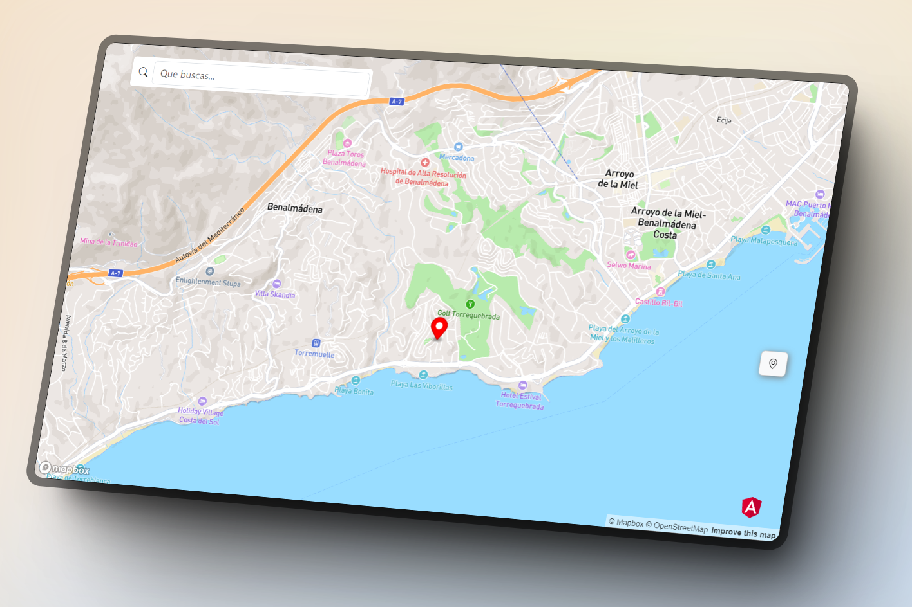

# MapsApp

## Description

This is a simple application that allows users to explore maps and perform various actions. Made in Angular 17 with standalone components.

## Features

- Map display
- Zoom in/out functionality
- Search for locations
- Routing and directions

## Installation

1. Clone the repository.
2. Install dependencies: `npm install`
3. Start the application: `npm start`

## Usage

1. Open the application in your web browser.
2. Explore the map by dragging, zooming, and searching for locations.
3. Use the routing feature to get directions between two points.

## Contributing

Contributions are welcome! If you find any issues or have suggestions for improvements, please open an issue or submit a pull request.

## License

This project is licensed under the [MIT License](https://opensource.org/licenses/MIT).
